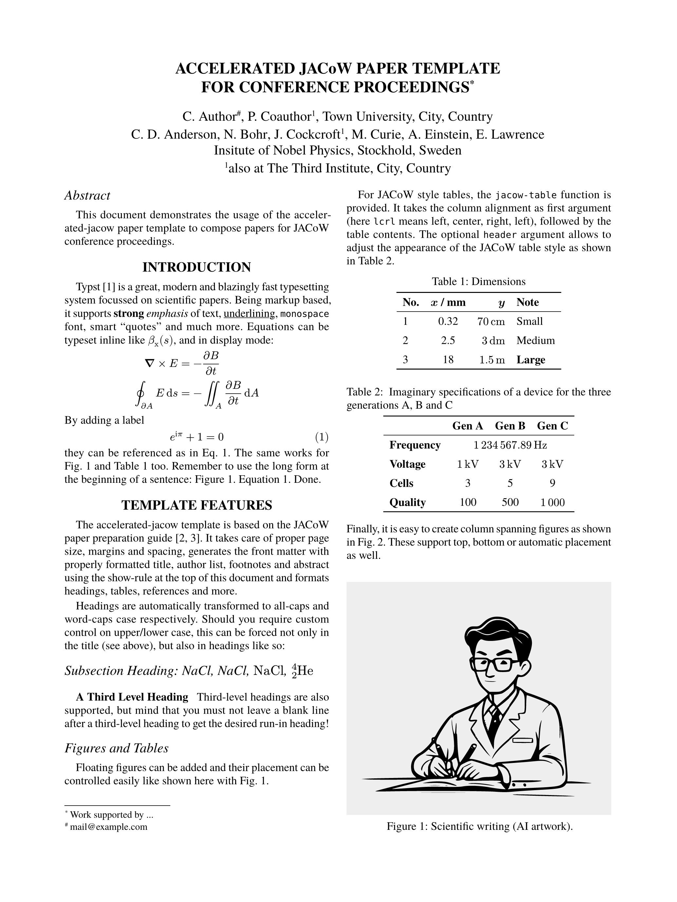

# Accelerated JACoW template for typst

[](https://github.com/eltos/accelerated-jacow)
[](https://typst.app/universe/package/accelerated-jacow)


Paper template for conference proceedings in accelerator physics.

Based on the JACoW guide for preparation of papers
available at https://jacow.org/.

## Usage

### Typst web app
In the [typst web app](https://typst.app/app?template=accelerated-jacow) select "start from template" and search for the accelerated-jacow template.
Alternatively, use the "create project" button at the top of the package's [typst universe page](https://typst.app/universe/package/accelerated-jacow).

### Local installation
Run these commands inside your terminal:
```sh
typst init @preview/accelerated-jacow
cd accelerated-jacow
typst watch paper.typ
```

If you don't yet have the *TeX Gyre Termes* font family, you can install it with `sudo apt install tex-gyre`.



### API documentation

The template exposes the `jacow` function which can be used with a show rule:
```typ
#show: jacow.with(
  title: [ Paper title ],
  authors: (),
  affiliations: (:),
  funding: "Work supported by ...",
  abstract: [ #lorem(20) ],
  //show-grid: true
)
```
It expects the following parameters:
- `title` (content): The paper title
- `authors` (list): The list of authors.
  Each author is specified as a dict with the following keys:
  - `name` (str) or `names` (list of str): The name of the author, or a list of author names with the same affiliations(s)
  - `at` (str or list): The affiliation of the author(s), or a list of affiliations with the first one being the primary affiliation.
    The affiliation is specified as string corresponding to a key in the affiliations dictionary (see below).
    Primary affiliations may alternatively be specified directly in their full form ("Affiliation, City, Country").
  - `email` (str, optional): The email address for the corresponding author(s)
- `affiliations` (dict): Dictionary mapping affiliation keys as used with `at` in the author list to their full form (str or content, e.g. "Affiliation, City, Country").
  It is possible to insert newline characters to manually adjust the layout if required.
- `funding` (str, optional): The funding note
- `abstract` (content): The abstract
- `show-grid` (bool, optional): Switch to enable a measurement grid for debugging purposes
- `paper-size`: (str, optional): The paper size. One of "a4", "letter" or "jacow" (default), the latter being the intersection of the two former ones.

In accordance with the JACoW style guide, the author list is automatically grouped by affiliation and sorted alphabetically, with the corresponding author preceding other authors.

See [template/paper.typ](template/paper.typ) for a usage example.


## Licence

Files inside the template folder are licensed under MIT-0. You can use them without restrictions.  
The citation style (CSL) file is based on the IEEE style and licensed under the [CC BY SA 4.0](https://creativecommons.org/licenses/by-sa/4.0/) compatible [GPLv3](https://www.gnu.org/licenses/gpl-3.0.html) license.  
All other files are licensed under [GPLv3](https://www.gnu.org/licenses/gpl-3.0.html).  
